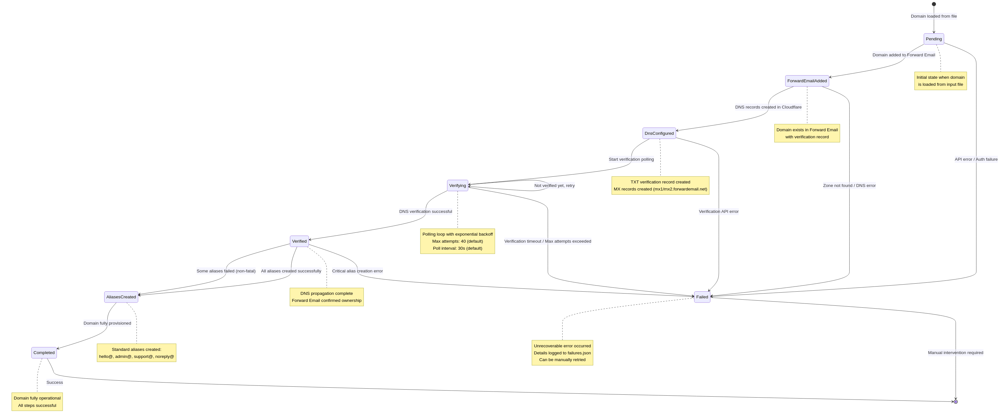
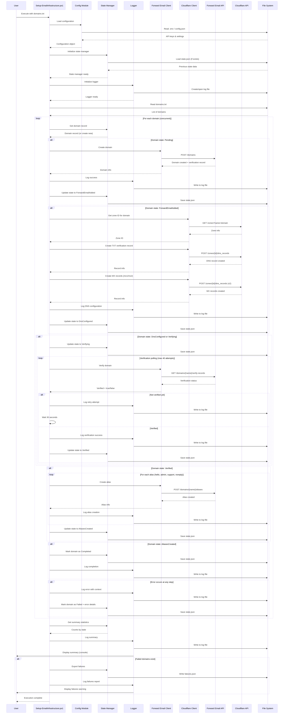
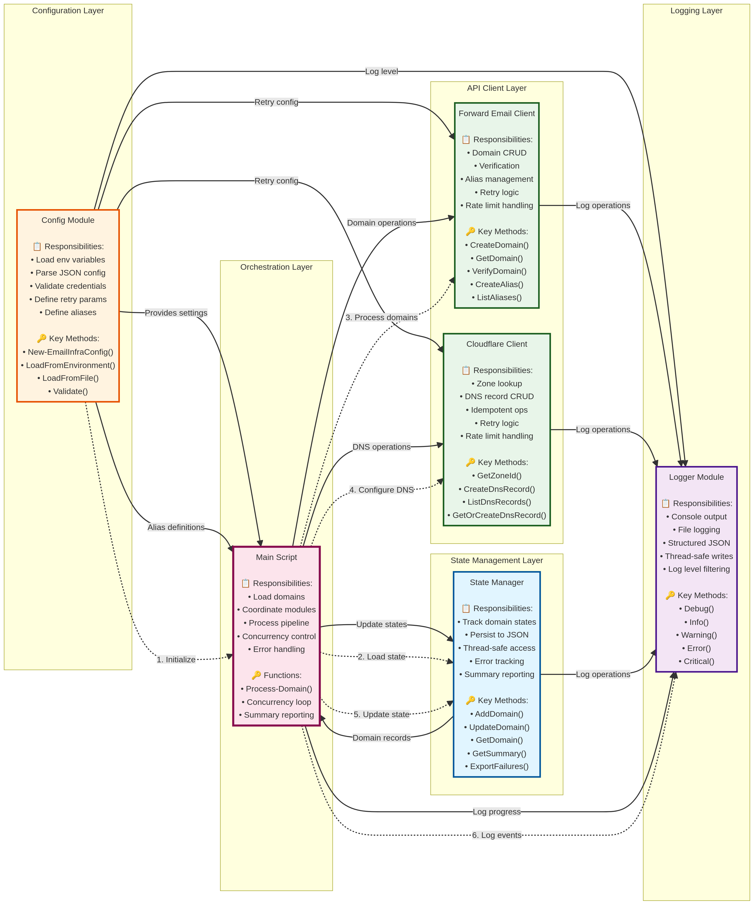

# Architecture Diagrams

This document provides detailed architecture diagrams for the Email Infrastructure Automation system, illustrating the modular components, data flow, state transitions, and module interactions.

## 1. System Architecture Overview

This diagram shows the complete system architecture with all five modular components, the main orchestration script, external services, and data flow between layers.


### Key Components

**Input Layer**: The system accepts three types of input:
- **domains.txt**: Plain-text file containing the list of domains to process (one per line)
- **Environment Variables**: API credentials and configuration settings loaded from `.env` file
- **config.json**: Optional JSON configuration file for environment-specific overrides

**Core Modules Layer**: Five specialized modules provide distinct functionality:
- **Config Module**: Centralized configuration management with validation and environment variable loading
- **State Manager**: Persistent state tracking with thread-safe JSON file operations
- **Logger**: Structured logging to console (color-coded) and file (JSON format)
- **Forward Email Client**: API client for Forward Email with retry logic and rate limit handling
- **Cloudflare Client**: API client for Cloudflare DNS management with idempotent operations

**Orchestration Layer**: The main script (`Setup-EmailInfrastructure.ps1`) coordinates all modules and implements the domain processing pipeline with concurrency control.

**Processing Pipeline**: Each domain progresses through six sequential steps with state transitions tracked at each stage.

**External Services**: The system integrates with two external APIs:
- **Forward Email API** (api.forwardemail.net): Domain and alias management
- **Cloudflare API** (api.cloudflare.com): DNS zone and record management

**Output Layer**: The system produces four types of output:
- **state.json**: Persistent state file tracking all domain progress
- **automation.log**: Structured log file with detailed execution history
- **failures.json**: Detailed report of failed domains with error context
- **Console Output**: Real-time status updates with color-coded messages

### Data Flow

The diagram uses different line styles to indicate different types of interactions:
- **Solid arrows**: Primary data flow and dependencies
- **Dotted arrows**: API calls, state updates, and logging operations

---

## 2. Domain State Machine

This diagram illustrates the state machine that governs each domain's progression through the processing pipeline.



### State Definitions

Each domain exists in one of eight possible states:

1. **Pending**: Initial state when the domain is loaded from the input file. No processing has occurred yet.

2. **ForwardEmailAdded**: The domain has been successfully added to Forward Email and a verification record has been generated.

3. **DnsConfigured**: All required DNS records (TXT verification record and MX records) have been created in Cloudflare.

4. **Verifying**: The system is actively polling Forward Email to check if DNS verification has completed. This state represents the waiting period for DNS propagation.

5. **Verified**: Forward Email has successfully verified domain ownership via DNS. The domain is ready for alias creation.

6. **AliasesCreated**: All configured email aliases have been created for the domain.

7. **Completed**: The domain has been fully provisioned and all steps completed successfully. This is the final success state.

8. **Failed**: An unrecoverable error occurred at some point in the pipeline. The domain requires manual intervention or retry.

### State Transitions

**Success Path**: The typical successful flow is:
```
Pending → ForwardEmailAdded → DnsConfigured → Verifying → Verified → AliasesCreated → Completed
```

**Failure Paths**: Domains can transition to the Failed state from multiple points:
- From **Pending**: API authentication failure or Forward Email service error
- From **ForwardEmailAdded**: Cloudflare zone not found or DNS API error
- From **DnsConfigured**: Verification API error
- From **Verifying**: Verification timeout after maximum polling attempts
- From **Verified**: Critical alias creation error (rare)

**Retry Behavior**: The **Verifying** state includes a self-loop, representing the polling mechanism that repeatedly checks verification status until success or timeout.

### State Persistence

The state is persisted to `state.json` after every transition, enabling:
- Safe interruption and resumption of processing
- Recovery from system failures without data loss
- Incremental processing of large domain lists
- Detailed progress tracking and reporting

---

## 3. Data Flow Sequence

This sequence diagram shows the detailed interactions between all components during a complete domain processing cycle.



### Execution Flow

The sequence diagram illustrates the chronological order of operations from script execution to completion:

**1. Initialization Phase**:
- User executes the script with a domains file
- Configuration is loaded from environment variables and optional config file
- State manager initializes and loads previous state (if exists)
- Logger initializes and opens log file
- Domain list is read from input file

**2. Domain Processing Phase** (for each domain, potentially concurrent):

**Step 1 - Add to Forward Email**:
- Script checks domain state (Pending)
- Forward Email client makes POST request to create domain
- API returns domain info including verification record
- State is updated to ForwardEmailAdded and persisted

**Step 2 - Configure DNS**:
- Script checks domain state (ForwardEmailAdded)
- Cloudflare client retrieves zone ID for the domain
- TXT verification record is created via Cloudflare API
- Two MX records are created (mx1.forwardemail.net, mx2.forwardemail.net)
- State is updated to DnsConfigured and persisted

**Step 3 - Verify Domain**:
- Script checks domain state (DnsConfigured or Verifying)
- State is updated to Verifying
- Polling loop begins (up to 40 attempts by default):
  - Forward Email client checks verification status
  - If not verified, wait 30 seconds and retry
  - If verified, exit loop and update state to Verified

**Step 4 - Create Aliases**:
- Script checks domain state (Verified)
- For each configured alias (hello, admin, support, noreply):
  - Forward Email client creates alias via API
  - Success is logged
- State is updated to AliasesCreated and persisted

**Step 5 - Mark Completed**:
- Script updates state to Completed
- Success is logged

**Error Handling**:
- At any step, if an error occurs:
  - Error is logged with full context
  - Domain state is updated to Failed with error details
  - State is persisted
  - Processing continues with next domain

**3. Finalization Phase**:
- Summary statistics are retrieved from state manager
- Summary is logged and displayed to user
- If failed domains exist, failures are exported to failures.json
- Execution completes

### Concurrency Model

The diagram shows a single domain's flow, but the actual script processes multiple domains concurrently (default: 5). Each domain follows this same sequence independently, with thread-safe access to shared resources (state file, log file) coordinated by mutex locks.

---

## 4. Module Interactions

This diagram shows the relationships and dependencies between the five core modules and the main orchestration script.



### Module Responsibilities

Each module has a clearly defined set of responsibilities and public methods:

**Config Module**:
- Loads configuration from environment variables
- Parses optional JSON configuration files
- Validates API credentials
- Defines retry parameters (max retries, delays, backoff)
- Defines alias configurations
- **Key Methods**: `New-EmailInfraConfig()`, `LoadFromEnvironment()`, `LoadFromFile()`, `Validate()`

**State Manager**:
- Tracks domain states through the processing pipeline
- Persists state to JSON file with atomic writes
- Provides thread-safe access via mutex locks
- Tracks error history for each domain
- Generates summary statistics
- Exports failure reports
- **Key Methods**: `AddDomain()`, `UpdateDomain()`, `GetDomain()`, `GetSummary()`, `ExportFailures()`

**Logger**:
- Writes color-coded output to console
- Writes structured JSON logs to file
- Supports multiple log levels (DEBUG, INFO, WARNING, ERROR, CRITICAL)
- Provides thread-safe logging for concurrent operations
- Filters logs based on configured minimum level
- **Key Methods**: `Debug()`, `Info()`, `Warning()`, `Error()`, `Critical()`

**Forward Email Client**:
- Implements Forward Email REST API
- Handles domain creation, retrieval, and verification
- Manages email alias creation and listing
- Implements retry logic with exponential backoff
- Handles rate limiting (HTTP 429) automatically
- **Key Methods**: `CreateDomain()`, `GetDomain()`, `VerifyDomain()`, `CreateAlias()`, `ListAliases()`

**Cloudflare Client**:
- Implements Cloudflare REST API
- Handles zone lookup by domain name
- Manages DNS record creation, listing, updating, and deletion
- Provides idempotent "get-or-create" operations
- Implements retry logic with exponential backoff
- Handles rate limiting (HTTP 429) automatically
- **Key Methods**: `GetZoneId()`, `CreateDnsRecord()`, `ListDnsRecords()`, `GetOrCreateDnsRecord()`

### Dependency Flow

The diagram shows the initialization and execution flow:

1. **Configuration Phase**: Config module is initialized first, providing settings to all other modules
2. **State Loading**: State manager loads previous state (if exists)
3. **Domain Processing**: Main script uses Forward Email and Cloudflare clients to process domains
4. **State Updates**: After each operation, state manager persists the updated state
5. **Logging**: All modules log their operations through the logger

### Module Isolation

The modular design provides several benefits:
- **Testability**: Each module can be tested independently
- **Maintainability**: Changes to one module don't affect others
- **Reusability**: Modules can be used in other scripts or tools
- **Extensibility**: New modules can be added without modifying existing ones

---

## Using These Diagrams

### For Understanding

If you're new to the system, review the diagrams in this order:
1. **System Architecture** - Get the big picture
2. **State Machine** - Understand domain lifecycle
3. **Module Interactions** - Learn module responsibilities
4. **Data Flow Sequence** - See detailed execution flow

### For Development

When modifying or extending the system:
- Refer to **Module Interactions** to understand dependencies
- Consult **State Machine** when adding new states or transitions
- Review **Data Flow Sequence** when debugging issues

### For Operations

When troubleshooting production issues:
- Use **State Machine** to understand where a domain is stuck
- Reference **Data Flow Sequence** to trace the execution path
- Check **System Architecture** to identify which component is failing

---

## Diagram Source Files

All diagrams are generated from Mermaid source files located in the `diagrams/` directory:
- `system-architecture.mmd` - System architecture overview
- `state-machine.mmd` - Domain state machine
- `data-flow-sequence.mmd` - Detailed sequence diagram
- `module-interactions.mmd` - Module relationships

To regenerate the diagrams after modifying the source files:

```bash
cd diagrams
manus-render-diagram system-architecture.mmd system-architecture.png
manus-render-diagram state-machine.mmd state-machine.png
manus-render-diagram data-flow-sequence.mmd data-flow-sequence.png
manus-render-diagram module-interactions.mmd module-interactions.png
```

Or regenerate all at once:

```bash
cd diagrams
for file in *.mmd; do manus-render-diagram "$file" "${file%.mmd}.png"; done
```
