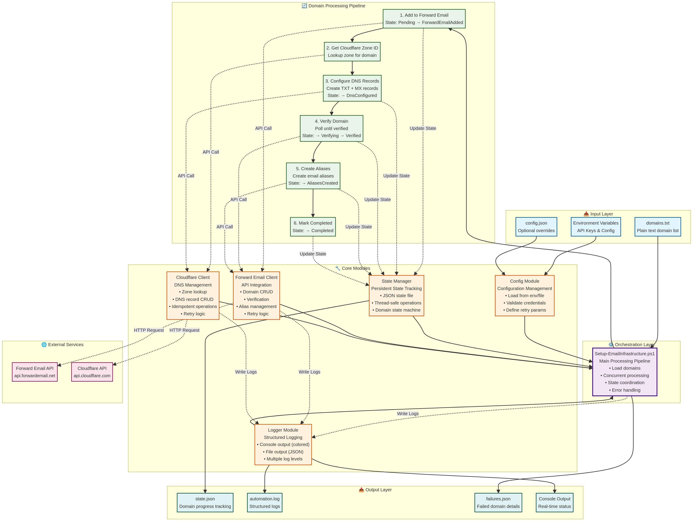

# Email Infrastructure Automation for PowerShell

This project provides robust PowerShell 7 scripts to automate the full lifecycle of email infrastructure setup across a large domain portfolio. It integrates with Forward Email and Cloudflare to turn a raw list of domains into fully functional, verified email-forwarding assets with standardized aliases.

This system is designed to be idempotent, state-aware, and resilient to transient failures, making it ideal for managing email infrastructure at scale.

## 🚀 Quick Start

### Option 1: Full Automation (Three-Phase Script)
```powershell
.\Setup-EmailInfrastructure-ThreePhase.ps1 -DomainsFile "data\domains.txt"
```

### Option 2: Manual Verification Workflow (Recommended)
```powershell
# Step 1: Configure DNS and attempt verification
.\Setup-EmailInfrastructure-ThreePhase.ps1

# Step 2: Manually verify domains in Forward Email dashboard
# https://forwardemail.net/my-account/domains

# Step 3: Run standalone Phase 3 to create aliases
.\Phase3-AliasGeneration.ps1
```

## 📦 Available Scripts

### Main Automation Scripts

1. **Setup-EmailInfrastructure-ThreePhase.ps1** - Improved three-phase automation
   - Phase 1: DNS Configuration (adds domains, configures TXT + MX records)
   - Phase 2: Domain Verification (improved verification logic)
   - Phase 3: Alias Generation (creates 50 unique aliases per domain)
   - Best for: Full automation with better verification

2. **Phase3-AliasGeneration.ps1** - Standalone alias generation
   - Runs independently after manual domain verification
   - Processes all verified domains or specific domains
   - Creates customizable number of aliases per domain (default: 50)
   - Best for: Manual verification workflow, selective processing

3. **Setup-EmailInfrastructure-TwoPhase.ps1** - Two-phase batch processing
   - Phase 1: DNS Configuration (batch)
   - Phase 2: Verification & Aliases (batch)
   - Note: Use three-phase script for better verification

4. **Setup-EmailInfrastructure.ps1** - Original sequential processing
   - Processes domains one at a time
   - Note: Slower than batch processing scripts

### Key Improvements in Three-Phase Script

- **Better Verification**: Uses GetDomain() instead of VerifyDomain() for status checks
- **Longer Wait Times**: 180s DNS propagation wait (up from 120s)
- **More Retries**: 5 verification attempts with 15s delays (up from 3 with 10s)
- **Detailed Errors**: Shows exactly which DNS records are missing (MX, TXT)
- **Standalone Phase 3**: Can run alias generation independently

### Phase 3 Features

- Creates info@ alias + 49 unique generated aliases per domain
- 60/40 mix of firstName vs firstName.lastName format
- Global uniqueness tracking across all domains
- Exports all aliases to data/aliases.txt
- Safe to re-run - skips domains that already have aliases

## ✨ Features

- **Bulk Domain Processing**: Reads a plain-text list of domains for batch processing.
- **Forward Email Integration**: Automatically adds domains to your Forward Email account.
- **Cloudflare DNS Automation**: Creates and verifies required TXT and MX records in Cloudflare.
- **Resilient Verification**: Implements polling with exponential backoff to handle DNS propagation delays.
- **Standardized Alias Creation**: Populates each verified domain with a predefined set of email aliases.
- **State Persistence**: Tracks the progress of each domain in a JSON state file, allowing for safe interruption and resumption.
- **Comprehensive Logging**: Generates structured logs for observability and debugging.
- **Error Handling & Reporting**: Isolates failures, logs detailed error reasons, and exports a list of failed domains for manual review.
- **Concurrency Control**: Processes multiple domains concurrently to improve throughput.

### Additional Documentation

- **QUICK-START-PHASE3.md** - Quick reference for standalone Phase 3
- **PHASE3-STANDALONE-GUIDE.md** - Comprehensive Phase 3 usage guide
- **IMPLEMENTATION-SUMMARY.md** - Technical overview and improvements
- **PHASE3-IMPROVEMENTS.md** - Detailed improvements documentation
- **PRE-FLIGHT-CHECKLIST.md** - Execution checklist and troubleshooting

## 📋 Requirements

- **PowerShell 7+**: The script is built on modern PowerShell features and requires version 7 or higher.
- **Forward Email Account**: A Forward Email account with an API key.
- **Cloudflare Account**: A Cloudflare account managing the domains you wish to configure, with an API token.

## Setup and Configuration

### 1. Clone the Repository

```bash
git clone <repository_url>
cd email-infrastructure-automation-ps
```

### 2. Configure Environment Variables

The script requires API credentials to be set as environment variables. Create a `.env` file in the root of the project directory by copying the example file:

```bash
cp .env.example .env
```

Now, edit the `.env` file and add your API credentials:

```dotenv
# .env

# Forward Email API Key (required)
FORWARD_EMAIL_API_KEY="your_forward_email_api_key_here"

# Cloudflare API Token (required)
# Must have DNS:Edit permissions for the relevant zones
CLOUDFLARE_API_TOKEN="your_cloudflare_api_token_here"

# Cloudflare Account ID (optional, but recommended)
CLOUDFLARE_ACCOUNT_ID="your_cloudflare_account_id_here"
```

### 3. Prepare Your Domain List

Create a text file (e.g., `data/domains.txt`) and list all the domains you want to process, with one domain per line. The script will ignore empty lines and lines starting with `#`.

```text
# data/domains.txt

example.com
example.net
# this-domain-will-be-ignored.org
another-domain.com
```

### 4. Customize Aliases (Optional)

The default aliases to be created are defined in `modules/Config.psm1`. You can modify this file to change the default alias list, or you can provide a custom JSON configuration file. See `examples/config-example.json` for the format.

## Usage

Once configured, you can run the main script from your PowerShell 7 terminal.

### Basic Execution

**Three-Phase Script (Recommended):**
```powershell
.\Setup-EmailInfrastructure-ThreePhase.ps1 -DomainsFile data\domains.txt
```

**Standalone Phase 3 (After Manual Verification):**
```powershell
.\Phase3-AliasGeneration.ps1
```

**Original Sequential Script:**
```powershell
.\Setup-EmailInfrastructure.ps1 -DomainsFile data\domains.txt
```

### Running the Setup Test

Before running the main script, it is highly recommended to run the test script to validate your environment and configuration:

```powershell
.\Test-Setup.ps1
```

This will check your PowerShell version, module integrity, environment variables, and API connectivity without making any changes.

### Command-Line Parameters

The script accepts several parameters to customize its behavior:

- `-DomainsFile <string>`: Path to the input domains file. (Default: `data/domains.txt`)
- `-ConfigFile <string>`: Optional path to a JSON configuration file to override defaults.
- `-StateFile <string>`: Path for the state persistence file. (Default: `data/state.json`)
- `-LogFile <string>`: Path for the log file. (Default: `logs/automation.log`)
- `-LogLevel <string>`: Logging level (DEBUG, INFO, WARNING, ERROR, CRITICAL). (Default: `INFO`)
- `-ConcurrentDomains <int>`: Number of domains to process in parallel. (Default: `5`)
- `-DryRun`: Switch to perform validation and show what would be done without making any API calls.

For detailed usage examples, see the [USAGE.md](USAGE.md) file.

## Architecture

The system is built on five modular components that work together to process domains through a well-defined state machine. For detailed architecture diagrams and technical documentation, see [DIAGRAMS.md](DIAGRAMS.md).



## How It Works

The script follows a state machine for each domain, ensuring that each step is completed successfully before moving to the next. The state is saved continuously, so if the script is stopped, it can be restarted and will resume from where it left off.

### Domain States

1.  **Pending**: The initial state of a domain loaded from the input file.
2.  **ForwardEmailAdded**: The domain has been successfully added to Forward Email.
3.  **DnsConfigured**: The required MX and TXT records have been created in Cloudflare.
4.  **Verifying**: The script is actively polling Forward Email to confirm DNS verification.
5.  **Verified**: The domain has been successfully verified by Forward Email.
6.  **AliasesCreated**: The predefined email aliases have been created for the domain.
7.  **Completed**: The domain has been fully processed successfully.
8.  **Failed**: An unrecoverable error occurred. Details are logged and saved to `data/failures.json`.

## Troubleshooting

- **Authentication Errors**: Double-check that your API keys in the `.env` file are correct and have the necessary permissions (DNS:Edit for Cloudflare).
- **Domain Not Found in Cloudflare**: Ensure the domains you are processing are active in the Cloudflare account associated with your API token.
- **Verification Timeouts**: If domains consistently fail with verification timeouts, you may need to increase the `VerificationMaxAttempts` or `VerificationPollInterval` settings in the configuration.

For more detailed troubleshooting steps, see the [TROUBLESHOOTING.md](TROUBLESHOOTING.md) file.
